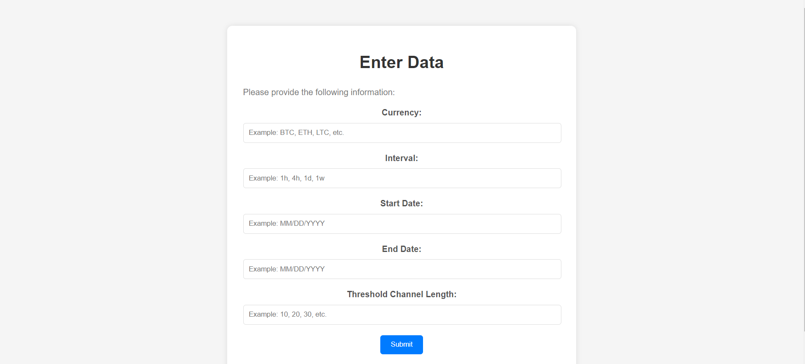
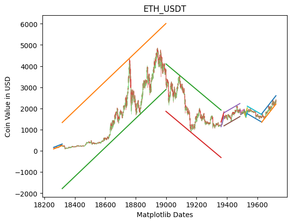

✤ Data Analysis using Linear Regression in Financial Data

· Deployed Link - https://huggingface.co/spaces/suryanshs16103/Data-Analysis-using-Linear-Regression-in-Financial-Data

· Overview: Implemented linear regression to create resistance and support trendlines for Financial Time Series Data

· Utilized linear regression to generate regression lines, identifying pivot points using accuracy-based approach

· Developed resistance and support trendlines parallel to the best-fit regression line with y intercept as variable parameter

· Implemented binary search to calculate y-intercepts, ensuring no intersection of trend lines with the candlestick data

· Developed Epsilon parameter, to define permissible wick intersections, enhancing the precision of the analysis

✤ Implementing the code

The code is available at Data_Analysis_using_Linear_Regression.ipynb and can be implemented on colab

The Requirements are available in requirements.txt

✤ Instructions for Running Program

Enter the following command to start thr program.

python -u "main.py"

Enter the Name of CrytoCurrency (Symbol) and Duration of Analysis in Webpage

-- Screenshot of Webpage

-- Output

